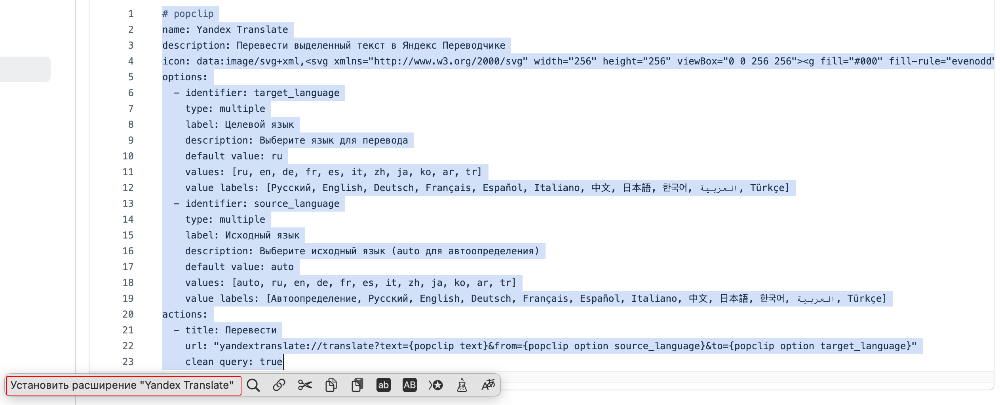

  

# Yandex Translate PopClip Extension

A PopClip extension for translating selected text using Yandex Translate with customizable source and target language selection.

## Features

- 🌍 **Multi-language support**: Translate between 11+ popular languages
- 🔄 **Auto-detection**: Automatic source language detection
- ⚙️ **Customizable**: Choose both source and target languages
- 🚀 **Quick access**: Translate with a single click from any text selection
- 🎯 **Native integration**: Uses Yandex Translate app URL scheme

## Supported Languages

- Russian (Русский)
- English
- German (Deutsch)
- French (Français)
- Spanish (Español)
- Italian (Italiano)
- Chinese (中文)
- Japanese (日本語)
- Korean (한국어)
- Arabic (العربية)
- Turkish (Türkçe)

## Installation

### Method: Snippet Installation
1. Copy the content from [`YandexTranslate`](YandexTranslate.yaml)
2. Select the text and click "Install Extension" in PopClip bar
3. Configure your preferred languages in PopClip settings

## Usage

1. Select any text you want to translate
2. Click the "Перевести" (Translate) button in PopClip bar
3. Yandex Translate app will open with your text ready for translation

## Configuration

Access PopClip settings to customize:
- **Target Language**: Choose your preferred translation language
- **Source Language**: Set source language or use auto-detection

## Requirements

- macOS 10.15 or later
- PopClip 2021.11 or later
- Yandex Translate app

## Development

This extension is built as a PopClip snippet using YAML configuration. The main files:

- [`YandexTranslate`](YandexTranslate.yaml) - Main extension code

<!-- BEGIN:YandexTranslate -->
<!-- END:YandexTranslate -->

## License

This project is licensed under the MIT License - see the [LICENSE](LICENSE) file for details.

## Acknowledgments

- [PopClip](https://www.popclip.app) by Pilotmoon Software
- [Yandex Translate](https://translate.yandex.com) service
- Icon design inspired by Yandex branding

---

**Note**: This is an unofficial extension. Yandex Translate is a trademark of Yandex LLC.
