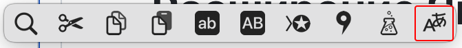

<p align="center">
  <a href="README.ru.md"></a>
</p>

# Yandex Translate PopClip Extension

A PopClip extension for translating selected text using Yandex Translate with customizable source and target language selection.

## Screenshots

### Extension Installation Dialog
When copying the snippet, PopClip displays the installation window.


### Extension Settings
Configure source and target languages for translation.


### PopClip Bar in Action
The translation button appears when you select text.



## Features

- 🌍 **Multi-language support**: Translate between 11+ popular languages
- 🔄 **Auto-detection**: Automatic source language detection
- ⚙️ **Customizable**: Choose both source and target languages
- 🚀 **Quick access**: Translate with a single click from any text selection
- 🎯 **Native integration**: Uses Yandex Translate app URL scheme

## Supported Languages

- Russian (Русский)
- English
- German (Deutsch)
- French (Français)
- Spanish (Español)
- Italian (Italiano)
- Chinese (中文)
- Japanese (日本語)
- Korean (한국어)
- Arabic (العربية)
- Turkish (Türkçe)

## Installation

### Method 1: Snippet Installation
1. Copy the content from [`YandexTranslate`](YandexTranslate.popclipext/Config.yaml)
2. Select the text and click "Install Extension" in PopClip bar
3. Configure your preferred languages in PopClip settings

### Method 2: Extension Installation
1. Download the extension [`YandexTranslate.popclipextz`](https://github.com/nikolalek/PopClip-Extensions-for-Yandex-Translate-MacOS/raw/refs/heads/main/YandexTranslate.popclipextz)

2. Double-click the `YandexTranslate.popclipextz` file to install it
3. Configure your preferred languages in PopClip settings

## Usage

1. Select any text you want to translate
2. Click the "Перевести" (Translate) button in PopClip bar
3. Yandex Translate app will open with your text ready for translation

## Configuration

Access PopClip settings to customize:
- **Target Language**: Choose your preferred translation language
- **Source Language**: Set source language or use auto-detection

## Requirements

- macOS 10.15 or later
- PopClip 2021.11 or later
- Yandex Translate app

## Development

This extension is built as a PopClip snippet using YAML configuration. The main files:

- [`YandexTranslate`](YandexTranslate.popclipext/Config.yaml) - Main extension code
```yaml
#popclip
name:
  en: Yandex Translate
  ru: Яндекс Переводчик
  de: Yandex Übersetzer
  fr: Yandex Traducteur
  es: Yandex Traductor
  it: Yandex Traduttore
  zh: Yandex 翻译
  ja: Yandex 翻訳
  ko: Yandex 번역
  ar: ياندكس الترجمة
  tr: Yandex Çeviri
identifier: ru.nikolalek.extension.yandex.translate
icon: iconify:material-symbols:translate-rounded
# @version 1.0.1
# @author nikolalek
# @license MIT
# @see https://apps.apple.com/app/yandex-translate/id584291439
description:
  en: "Translate selected text in Yandex Translate app"
  ru: "Перевод выделенного текста в приложении Яндекс Переводчик"
  de: "Übersetzen Sie markierten Text in der Yandex Übersetzer-App"
  fr: "Traduire le texte sélectionné dans l'application Yandex Traducteur"
  es: "Traducir el texto seleccionado en la aplicación Yandex Traductor"
  it: "Traduci il testo selezionato nell'app Yandex Traduttore"
  zh: "在 Yandex 翻译应用中翻译选定的文本"
  ja: "選択したテキストをYandex翻訳アプリで翻訳"
  ko: "Yandex 번역 앱에서 선택한 텍스트 번역"
  ar: "ترجمة النص المحدد في تطبيق ياندكس الترجمة"
  tr: "Seçili metni Yandex Çeviri uygulamasında çevirin"
app:
  name: Yandex Translate
  link: https://apps.apple.com/app/yandex-translate/id584291439
  check installed: true
  bundle identifiers:
   - ru.yandex.mobile.translate  
options title:
  en: Translation Settings
  ru: Настройки перевода
  de: Übersetzungseinstellungen
  fr: Paramètres de traduction
  es: Configuración de traducción
  it: Impostazioni di traduzione
  zh: 翻译设置
  ja: 翻訳設定
  ko: 번역 설정
  ar: إعدادات الترجمة
  tr: Çeviri Ayarları
options:
  - identifier: target_language
    type: multiple
    label:
      en: Target Language
      ru: Язык перевода
      de: Zielsprache
      fr: Langue cible
      es: Idioma de destino
      it: Lingua di destinazione
      zh: 目标语言
      ja: 翻訳先言語
      ko: 대상 언어
      ar: اللغة الهدف
      tr: Hedef Dil
    default value: ru
    values: [ru, en, de, fr, es, it, zh, ja, ko, ar, tr]
    value labels:
      - 🇷🇺 Русский
      - 🇬🇧 English
      - 🇩🇪 Deutsch
      - 🇫🇷 Français
      - 🇪🇸 Español
      - 🇮🇹 Italiano
      - 🇨🇳 中文
      - 🇯🇵 日本語
      - 🇰🇷 한국어
      - 🇸🇦 العربية
      - 🇹🇷 Türkçe
actions:
  - title:
      en: Translate
      ru: Перевести
      de: Übersetzen
      fr: Traduire
      es: Traducir
      it: Tradurre
      zh: 翻译
      ja: 翻訳
      ko: 번역
      ar: ترجمة
      tr: Çevir
    requirements: [text]
    url: "yandextranslate://translate?text={popclip text}&from=auto&to={popclip option target_language}"
    clean query: true

```

## License

This project is licensed under the MIT License - see the [LICENSE](LICENSE) file for details.

## Acknowledgments

- [PopClip](https://www.popclip.app) by Pilotmoon Software
- [Yandex Translate](https://translate.yandex.com) service
- Icon design inspired by Yandex branding

---

**Note**: This is an unofficial extension. Yandex Translate is a trademark of Yandex LLC.
