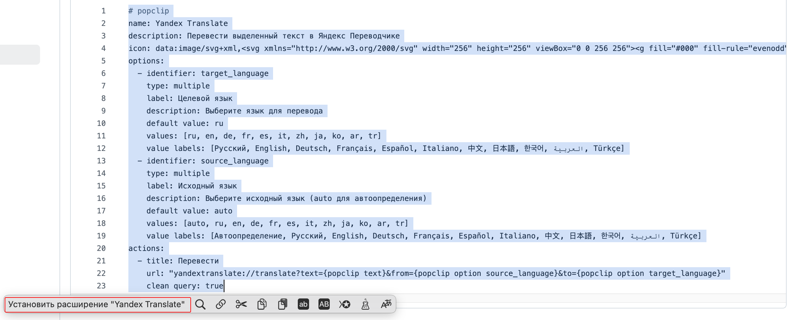
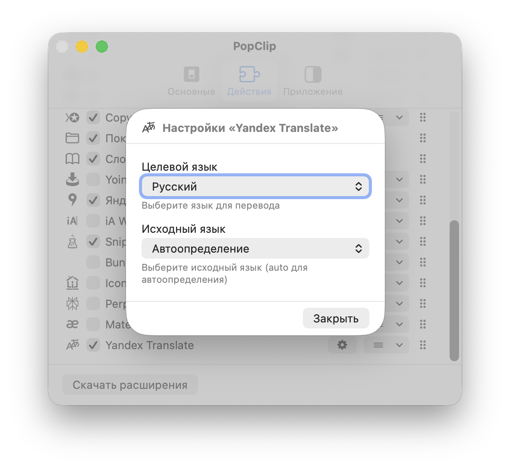
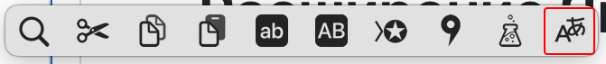

[](README.md)


# Расширение Яндекс Переводчик для PopClip

Расширение PopClip для перевода выделенного текста с помощью Яндекс Переводчика с возможностью выбора исходного и целевого языков.







## Возможности

- 🌍 **Поддержка многих языков**: Перевод между 11+ популярными языками
- 🔄 **Автоопределение**: Автоматическое определение исходного языка
- ⚙️ **Настройка**: Выбор исходного и целевого языков
- 🚀 **Быстрый доступ**: Перевод одним кликом из любого выделенного текста
- 🎯 **Нативная интеграция**: Использует URL-схему приложения Яндекс Переводчик

## Поддерживаемые языки

- Русский
- English (Английский)
- Deutsch (Немецкий)
- Français (Французский)
- Español (Испанский)
- Italiano (Итальянский)
- 中文 (Китайский)
- 日本語 (Японский)
- 한국어 (Корейский)
- العربية (Арабский)
- Türkçe (Турецкий)

## Установка

### Способ: Установка снипета
1. Скопируйте содержимое файла [`YandexTranslate`](YandexTranslate.yaml)
2. Выделите текст и нажмите "Установить расширение" в панели PopClip
3. Настройте предпочитаемые языки в настройках PopClip

## Использование

1. Выделите любой текст для перевода
2. Нажмите кнопку "Перевести" в панели PopClip
3. Откроется приложение Яндекс Переводчик с готовым к переводу текстом


## Настройка

Откройте настройки PopClip для изменения:
- **Целевой язык**: Выберите предпочитаемый язык перевода
- **Исходный язык**: Установите исходный язык или используйте автоопределение

## Требования

- macOS 10.15 или новее
- PopClip 2021.11 или новее
- Приложение Яндекс Переводчик

## Разработка

Расширение создано как снипет PopClip с использованием YAML конфигурации. Основные файлы:

- [`YandexTranslate`](YandexTranslate.yaml) - Основной код расширения

```
# popclip
name:
  en: Yandex Translate
  ru: Яндекс Переводчик
description:
  en: Translate selected text in Yandex Translate with automatic source detection.
  ru: Перевести выделенный текст в Яндекс Переводчике с автоопределением языка.
icon: data:image/svg+xml,<svg xmlns="http://www.w3.org/2000/svg" width="256" height="256"><g fill-rule="evenodd" class="ytranslate"><path d="M247.133 102.306c-4.227-9.812-12.178-17.623-22.14-21.728 1.81-8.01 2.415-14.619 2.616-19.024h-18.115c-.302 4.706-1.006 9.512-2.013 14.118-14.089-2.003-29.99 0-45.287 5.407-1.71-9.813-2.818-19.025-3.421-27.035 54.445-3.004 86.548-15.82 88.058-16.521l-6.844-16.221s-30.795 12.015-81.818 15.02c0-12.117-.403-12.016.201-16.122l-18.115-.2c-.402 3.404-.302 7.009-.201 17.022h-1.71c-16.304 0-31.4-1.202-35.023-1.502L100 53.443c5.334.4 21.637 1.302 36.23 1.302h4.528c.705 9.913 2.013 21.528 4.428 34.144-24.052 14.018-43.173 41.053-33.411 63.081 4.025 9.212 11.976 15.42 22.14 16.722 1.811.2 3.623.4 5.434.4 10.366 0 22.241-4.105 33.614-11.114 4.025 6.108 8.755 11.815 13.988 17.022l12.48-12.917s-5.435-5.006-12.077-14.919c14.592-13.617 25.864-30.44 32.808-49.163 4.025 2.303 8.05 5.707 10.265 10.914 7.346 17.522-3.22 37.849-13.083 46.66l12.378 13.017c16.304-14.72 27.474-42.155 17.511-66.286zm-109.6 49.49a10.04 10.04 0 0 1-8.507-6.186c-4.305-10.176 5.33-26.636 21.523-37.61 4.1 13.967 9.224 25.938 14.451 35.515-9.839 5.986-19.986 9.378-27.467 8.28zm44.686-24.934L178.164 131c-4.46-8.867-8.92-19.506-12.164-32.117 11.759-4.531 24.43-6.502 37-5.714-4.764 12.414-11.86 23.842-20.78 33.792v-.099z" class="ytranslate"/><path d="M63.457 83 5 218h23.982l14.39-35.993h59.256L117.018 218H141L82.443 83zm8.994 27L94 163H51z" class="ytranslate"/></g></svg>
options title:
  en: Options for Yandex Translate
  ru: Параметры расширения
options:
  - identifier: source_language
    type: multiple
    label:
      en: Source language
      ru: Исходный язык
    description:
      en: Choose source language (auto = detect automatically)
      ru: Выберите исходный язык (auto = автоопределение)
    default value: auto
    values: [auto, ru, en, de, fr, es, it, zh, ja, ko, ar, tr]
    value labels:
      - Auto / Авто
      - Russian / Русский
      - English / Английский
      - German / Немецкий
      - French / Французский
      - Spanish / Испанский
      - Italian / Итальянский
      - Chinese / 中文
      - Japanese / 日本語
      - Korean / 한국어
      - Arabic / العربية
      - Turkish / Türkçe
  - identifier: target_language
    type: multiple
    label:
      en: Target language
      ru: Целевой язык
    description:
      en: Choose target language
      ru: Выберите язык перевода
    default value: ru
    values: [ru, en, de, fr, es, it, zh, ja, ko, ar, tr]
    value labels:
      - Russian / Русский
      - English / Английский
      - German / Немецкий
      - French / Французский
      - Spanish / Испанский
      - Italian / Итальянский
      - Chinese / 中文
      - Japanese / 日本語
      - Korean / 한국어
      - Arabic / العربية
      - Turkish / Türkçe
actions:
  - title:
      en: Translate
      ru: Перевести
    url: "yandextranslate://translate?text={popclip text}&from={popclip option source_language}&to={popclip option target_language}"
    clean query: true
```

## Лицензия

Проект лицензирован под лицензией MIT - подробности в файле [LICENSE](LICENSE).

## Благодарности

- [PopClip](https://www.popclip.app) от Pilotmoon Software
- Сервис [Яндекс Переводчик](https://translate.yandex.ru)
- Дизайн иконки вдохновлен брендингом Яндекса

---

**Примечание**: Это неофициальное расширение. Яндекс Переводчик является торговой маркой ООО «Яндекс».
